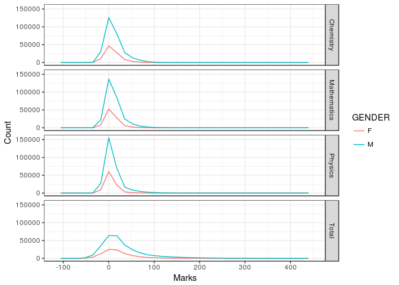
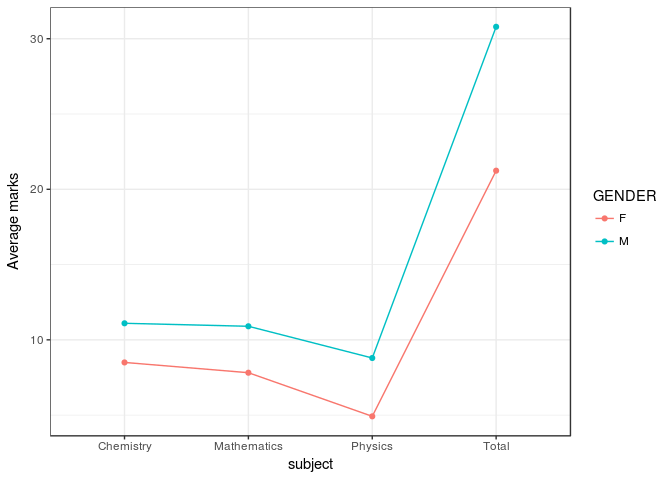
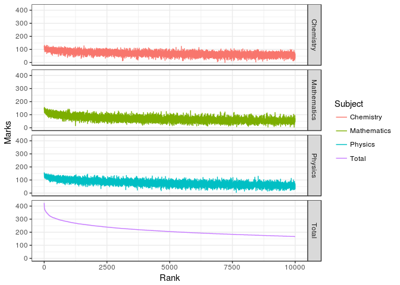
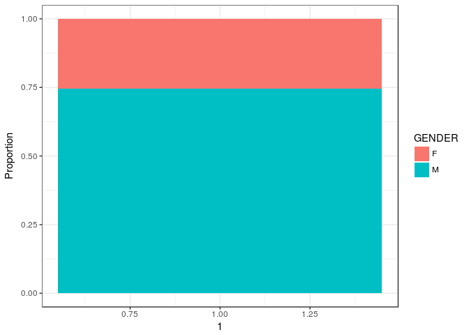
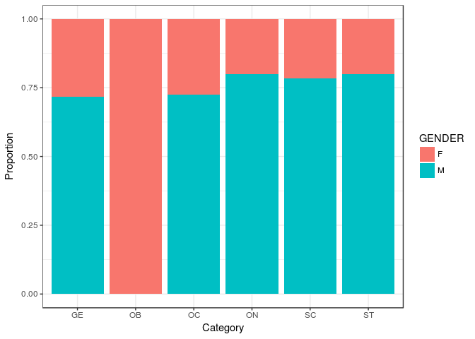

Jee-Analytics
================
Atreya
28 February 2018

### **Exploration of JEE dataset**

``` r
library(ggplot2)
library(dplyr)
library(tidyr)
```

Check out the structure of the data

``` r
df <- read.csv("data/jee2009.csv",stringsAsFactors=F)
str(df)
```

    ## 'data.frame':    384977 obs. of  11 variables:
    ##  $ REGST_NO    : int  2045263 2023172 2040146 2032358 2078152 2057352 2059321 2055376 2091101 2066060 ...
    ##  $ NAME        : chr  "VIBHU PAL" "NITESH BHARDWAJ" "MANJEET" "SHIKHAR DATTA" ...
    ##  $ category    : chr  "GE" "GE" "GE" "GE" ...
    ##  $ sub_category: chr  "NN" "NN" "NN" "NN" ...
    ##  $ GENDER      : chr  "M" "M" "M" "M" ...
    ##  $ PIN_RES     : chr  "208011" "110046" "110085" "110075" ...
    ##  $ PARENT_NAM  : chr  "SAROJ KUMAR PAL" "OM PRAKASH BHARDWAJ" "DEVENDER SINGH" "SUNIL KUMAR DATTA" ...
    ##  $ math        : int  30 38 29 6 11 8 8 19 16 35 ...
    ##  $ phys        : int  33 26 10 -8 -4 8 44 54 -4 38 ...
    ##  $ chem        : int  26 33 30 12 -9 20 47 49 20 39 ...
    ##  $ mark        : int  89 97 69 10 -2 36 99 122 32 112 ...

``` r
head(df)
```

    ##   REGST_NO            NAME category sub_category GENDER PIN_RES
    ## 1  2045263       VIBHU PAL       GE           NN      M  208011
    ## 2  2023172 NITESH BHARDWAJ       GE           NN      M  110046
    ## 3  2040146         MANJEET       GE           NN      M  110085
    ## 4  2032358   SHIKHAR DATTA       GE           NN      M  110075
    ## 5  2078152           RAJAT       GE           NN      M  121001
    ## 6  2057352   PRIYANK KUMAR       SC           NN      M  121003
    ##            PARENT_NAM math phys chem mark
    ## 1     SAROJ KUMAR PAL   30   33   26   89
    ## 2 OM PRAKASH BHARDWAJ   38   26   33   97
    ## 3      DEVENDER SINGH   29   10   30   69
    ## 4   SUNIL KUMAR DATTA    6   -8   12   10
    ## 5     RAJESHWAR SINGH   11   -4   -9   -2
    ## 6         PADAM CHAND    8    8   20   36

Total of around 4 lakh people appeared for the exam. I'll give a rank to these people. For now I'll give the same rank for reptitions. Also, `GENDER`, `category` and `subcategory` need to be converted to factor types.

``` r
df$jee_basic_rank <-df %>% 
                    select(mark) %>%
                    desc()%>%
                    row_number()
df$GENDER <- as.factor(df$GENDER)
df$category <- as.factor(df$category)
df$sub_category <- as.factor(df$sub_category)

df %>%
arrange(jee_basic_rank)%>%
head(10)
```

    ##    REGST_NO                   NAME category sub_category GENDER PIN_RES
    ## 1   2076372             NITIN JAIN       GE           NN      M  121001
    ## 2   1156155       SHUBHAM TULSIANI       GE           NN      M  342003
    ## 3   6004088         GOPI SIVAKANTH       ON           NN      M  533429
    ## 4   1070200    SHAH PARARTH PARESH       GE           NN      M  400057
    ## 5   6128176             PRASHANT V       GE           NN      M  600004
    ## 6   1067197 PRIYANK PRADEEP PARIKH       GE           NN      M  400058
    ## 7   1135360         NITISH JHAWA R       GE           NN      M  143006
    ## 8   6006189         M PRANAY KUMAR       ON           NN      M  509216
    ## 9   1134063      ANVIT SINGH TAWAR       GE           NN      M  390004
    ## 10  1177388            KAPIL DUBEY       GE           NN      M  470002
    ##                   PARENT_NAM math phys chem mark jee_basic_rank
    ## 1             NEM CHAND JAIN  153  149  122  424              1
    ## 2        KISHAN LAL TULSIANI  149  148  120  417              2
    ## 3              GOPI SRINIVAS  143  144  126  413              3
    ## 4         SHAH PARESH VIKRAM  136  156  117  409              4
    ## 5                VASUDEVAN R  141  151  115  407              5
    ## 6  PRADEEP KISHORKANT PARIKH  153  154   97  404              6
    ## 7       KAMAL KISHORE JHAWAR  151  127  118  396              7
    ## 8              M BALAKRISHNA  117  149  120  386              8
    ## 9       DEVENDRA SINGH TAWAR  156  124  105  385              9
    ## 10            RAJKUMAR DUBEY  132  146  106  384             10

Let's take a look at the extreme scores

``` r
extremes_df <- df %>%
               filter(math==max(math)) # maths champ
extremes_df <- df %>%
               filter(phys==max(phys))%>%
               bind_rows(extremes_df) #physics champ
extremes_df <- df %>%
               filter(chem==max(chem))%>%
               bind_rows(extremes_df) #chemistry champ
extremes_df <- df %>%
               filter(mark==max(mark))%>%
               bind_rows(extremes_df) #overall champ
extremes_df %>% arrange(desc(mark))
```

    ##   REGST_NO                 NAME category sub_category GENDER PIN_RES
    ## 1  2076372           NITIN JAIN       GE           NN      M  121001
    ## 2  1070200  SHAH PARARTH PARESH       GE           NN      M  400057
    ## 3  1134063    ANVIT SINGH TAWAR       GE           NN      M  390004
    ## 4  1067307 ABHISHEK PADMANABHAN       GE           NN      M  400607
    ## 5  1169264     HIMANSHU SHEKHAR       GE           NN      M  848502
    ##             PARENT_NAM math phys chem mark jee_basic_rank
    ## 1       NEM CHAND JAIN  153  149  122  424              1
    ## 2   SHAH PARESH VIKRAM  136  156  117  409              4
    ## 3 DEVENDRA SINGH TAWAR  156  124  105  385              9
    ## 4        S PADMANABHAN  132  118  132  382             13
    ## 5 HARENDRA KUMAR SINGH   99  121  132  352             90

Lemme check my details and a few of my friends'

``` r
df %>% filter(NAME=="ARAVIND B ATREYA")
```

    ##   REGST_NO             NAME category sub_category GENDER PIN_RES
    ## 1  6017173 ARAVIND B ATREYA       GE           NN      M  500013
    ##         PARENT_NAM math phys chem mark jee_basic_rank
    ## 1 B K NAGARAJA RAO  100   67   72  239           2491

``` r
friends_df <- df %>%
              filter(NAME=="V S R VIKRAM")
friends_df <- df %>%
              filter(row_number()==grep("*SANJAY DIXIT*",df$NAME,ignore.case=TRUE))%>%
              bind_rows(friends_df)
friends_df <- df %>%
              filter(row_number()==grep("*RACHIT KOTHARI*",df$NAME,ignore.case=TRUE))%>%
              bind_rows(friends_df)
friends_df
```

    ##   REGST_NO                     NAME category sub_category GENDER PIN_RES
    ## 1  1163191           RACHIT KOTHARI       GE           NN      M  302003
    ## 2  6088037 SANJAY DIXIT BHUVANAGIRI       GE           NN      M  530003
    ## 3  6024209             V S R VIKRAM       GE           NN      M  500028
    ##         PARENT_NAM math phys chem mark jee_basic_rank
    ## 1 RAJKUMAR KOTHARI   94   71   81  246           2181
    ## 2  B V H N SAINATH  124  111   66  301            515
    ## 3      V SITARAMAM   67  100   99  266           1325

### **Visualizations**

Tidying up data for visualizations is essential as it is difficult to create visualizations with the data in its current format. It will be easier to plot if all the marks are in rows as opposed to columns.

``` r
df_transform <-gather(df,subject,marks,math:mark)
subject_names <- function(x){
    if(x=="math"){
        x<-"Mathematics"
    } else if(x=="chem") {
        x<-"Chemistry"
    } else if(x=="phys") {
        x<-"Physics"
    } else {
        x<-"Total"
    }
}
df_transform$subject <- sapply(df_transform$subject,subject_names)
df_transform$subject <- as.factor(df_transform$subject)#convert to factor
df_transform <- df_transform %>%
                filter(GENDER!="")#Remove a few entries wit no GENDER,very less
head(df_transform)
```

    ##   REGST_NO            NAME category sub_category GENDER PIN_RES
    ## 1  2045263       VIBHU PAL       GE           NN      M  208011
    ## 2  2023172 NITESH BHARDWAJ       GE           NN      M  110046
    ## 3  2040146         MANJEET       GE           NN      M  110085
    ## 4  2032358   SHIKHAR DATTA       GE           NN      M  110075
    ## 5  2078152           RAJAT       GE           NN      M  121001
    ## 6  2057352   PRIYANK KUMAR       SC           NN      M  121003
    ##            PARENT_NAM jee_basic_rank     subject marks
    ## 1     SAROJ KUMAR PAL          36787 Mathematics    30
    ## 2 OM PRAKASH BHARDWAJ          31862 Mathematics    38
    ## 3      DEVENDER SINGH          53585 Mathematics    29
    ## 4   SUNIL KUMAR DATTA         221578 Mathematics     6
    ## 5     RAJESHWAR SINGH         288710 Mathematics    11
    ## 6         PADAM CHAND         112143 Mathematics     8

#### **Frequency plot of marks**

``` r
ggplot(data=df_transform,aes(x=marks,col=GENDER))+
geom_freqpoly()+
facet_grid(subject~.)+
labs(x="Marks",y="Count")+
theme_bw()
```

    ## `stat_bin()` using `bins = 30`. Pick better value with `binwidth`.



#### **Average marks**

``` r
#Compare boxplots Males vs Females
df_average <- df_transform %>%
              select(GENDER,subject,marks)%>%
              group_by(GENDER,subject)%>%
              summarize(Avg_marks=mean(marks))
ggplot(df_average,aes(x=subject,y=Avg_marks,col=GENDER,group=GENDER))+
geom_point()+
geom_line()+
labs(y="Average marks")+
theme_bw()
```



#### **Rank vs Marks, only top 10000**

``` r
ggplot(df_transform %>% filter(jee_basic_rank<10000),aes(x=jee_basic_rank,y=marks,col=subject))+
geom_line()+
facet_grid(subject~.)+
labs(x="Rank",y="Marks",col="Subject")+
theme_bw()
```



#### **Category-Gender wise appearance**

``` r
ggplot(df_transform,aes(x=1,fill=GENDER))+
geom_bar(position = "fill")+
labs(y="Proportion")+
theme_bw()
```



``` r
ggplot(df_transform,aes(x=category,fill=GENDER))+
geom_bar(position ="fill")+
labs(x="Category",y="Proportion")+
theme_bw()
```


